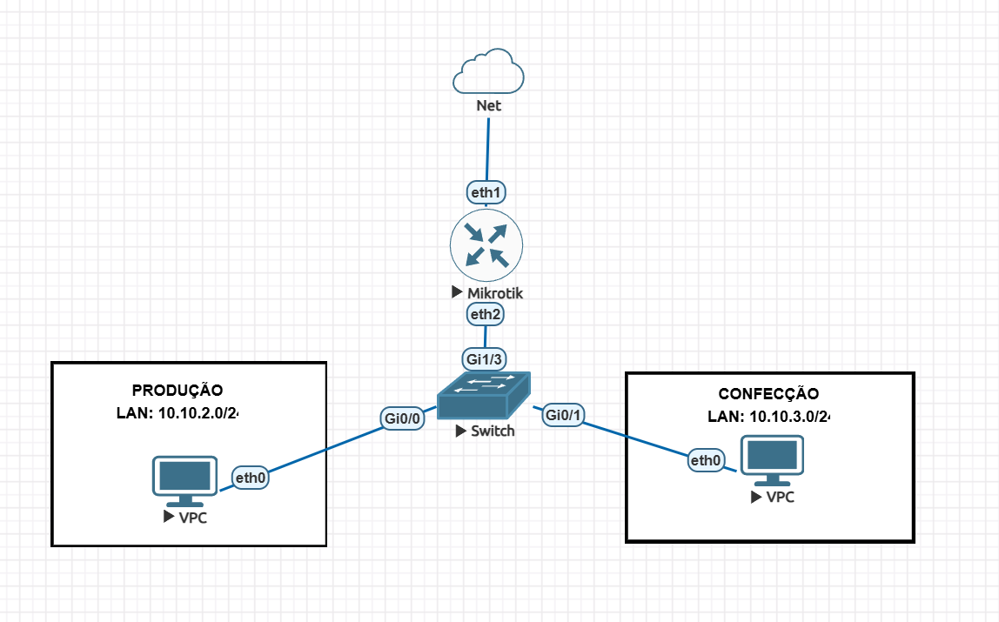

# Router-on-a-Stick com MikroTik e Cisco

Laboratório de redes desenvolvido no **EVE-NG** para aplicar conceitos de segmentação com VLANs, Router-on-a-Stick, DHCP, DNS, NAT e firewall utilizando **MikroTik RouterOS CHR** e **Cisco IOSv**.

## Topologia



| VLAN | Setor | Rede | Gateway | DNS |
|---|---|---|---|---|
| 2 | Produção | `10.10.2.0/24` | `10.10.2.1` | `8.8.8.8` |
| 3 | Confecção | `10.10.3.0/24` | `10.10.3.1` | `1.1.1.3` |

## Arquitetura

O switch Cisco realiza a segmentação em camada 2:

- `Gi0/0` — porta access da VLAN 2
- `Gi0/1` — porta access da VLAN 3
- `Gi1/3` — trunk 802.1Q até o MikroTik

No MikroTik, as VLANs foram criadas sobre a interface `ether2`:

```text
ether2
├── vlan2-PRODUC
└── vlan3-CONFEC
```

Cada VLAN possui gateway e escopo DHCP próprios.

O tráfego destinado à Internet utiliza **src-nat/masquerade** pela interface WAN, enquanto regras na chain `forward` impedem comunicação direta entre as duas VLANs.

## Conceitos aplicados

- VLANs e segmentação de rede
- Portas access e trunk
- IEEE 802.1Q
- Router-on-a-Stick
- Endereçamento IPv4 e gateways
- DHCP por VLAN
- DNS via DHCP
- Roteamento entre redes
- NAT / Masquerade
- Interface Lists no RouterOS
- Firewall e isolamento inter-VLAN
- Troubleshooting de camada 2 e camada 3

## Validação

| Teste | Resultado |
|---|---|
| DHCP nas duas VLANs | ✅ |
| Gateway por VLAN | ✅ |
| Resolução DNS | ✅ |
| Acesso à Internet | ✅ |
| NAT | ✅ |
| Trunk 802.1Q | ✅ |
| Isolamento entre VLANs | ✅ |

## Troubleshooting

Durante a implementação, o MikroTik CHR inicialmente não conseguia obter endereço via DHCP e também não apresentava comunicação utilizando IP estático.

O problema foi identificado no ambiente virtualizado: o **Hyper-V bloqueava tráfego originado pelos endereços MAC das máquinas executadas dentro do EVE-NG**.

A comunicação foi normalizada após habilitar **MAC Address Spoofing** na interface virtual da VM do EVE-NG.

Também foi necessário revisar as interfaces do switch Cisco e configurar corretamente as portas em modo **access** e **trunk**.

## Arquivos do projeto

```text
.
├── README.md
├── TOPOLOGIA.png
├── nat_routestick_firewallfilter.rsc
└── cisco-config
```

- `nat_routestick_firewallfilter.rsc` — export da configuração do MikroTik
- `cisco-config` — running-config do Cisco IOSv
- `TOPOLOGIA.png` — topologia do laboratório

## Ambiente utilizado

- EVE-NG
- MikroTik RouterOS CHR
- Cisco IOSv
- VPCS
- Hyper-V
